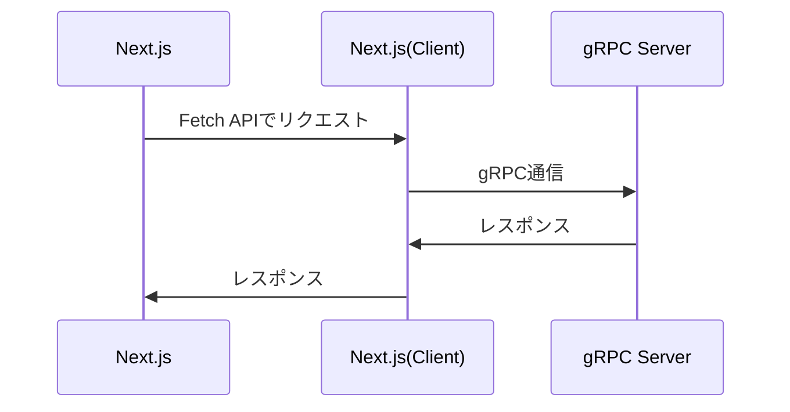

## gRPC サンプル実装

### ディレクトリ構成

```shell
/
├─ client // クライアント実装（Next.js）
├─ protos // Protocol Bufferの定義ファイル群
└─ server // サーバー実装
```

### 起動まで

```shell
# for server(from root)
cd server
npm install
npm run server-start

# for client(from root)
cd client
npm install
npm run dev
```

`http://localhost:3000/` にアクセスする

### シーケンス

gRPC では HTTP2 を利用して接続を行う  
WEB ブラウザから直接 HTTP2 は利用ができないため、プロキシを挟む必要がある  
このサンプルでは Next.js の API Route を利用して、サーバー間通信とすることで gRPC を実現する


